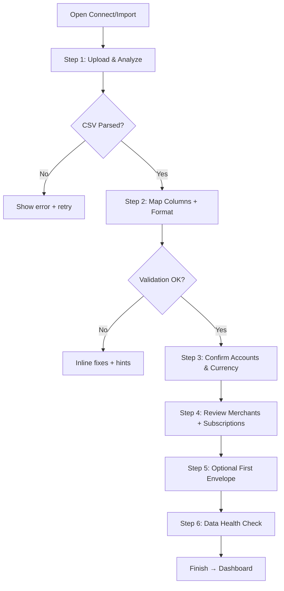

# Budgetsimple UI/UX Specification

## Introduction
This document defines the user experience goals, information architecture, user flows, and visual design specifications for Budgetsimple’s user interface. It serves as the foundation for visual design and frontend development, ensuring a cohesive and user-centered experience.

### Overall UX Goals & Principles
#### Target User Personas
- **First-time Importer:** New user who wants a guided, confident CSV import and “I’m done” confirmation.
- **Finance Power User:** Imports multiple CSVs, expects fast mapping, few clicks, and strong auditability.
- **Goal-Oriented Planner:** Focuses on envelopes and wants quick confidence that data is correct.

#### Usability Goals
- **Fast onboarding:** First dashboard with meaningful insights within 5–8 minutes.
- **Error clarity:** Validation errors are explicit, actionable, and recoverable without losing progress.
- **Confidence cues:** Every step shows a “what’s next + why this matters” summary.
- **Consistency:** The same mapping and review patterns for transactions + income.
- **Recovery:** Users can backtrack without losing mappings or choices.

#### Design Principles
1. **Guided, not gated** — hand-holding with skip options and visible progress.
2. **Confidence over speed** — show confirmations and data health checks before dashboard.
3. **Progressive disclosure** — advanced settings only when needed.
4. **Fix-in-place** — mapping/review edits happen where the user is, not in separate pages.
5. **Actionable feedback** — errors and warnings always include a next action.
6. **State continuity** — preserve mapping/review choices across steps.

### Change Log
| Date | Version | Description | Author |
| --- | --- | --- | --- |
| 2025-12-26 | 0.1 | Initial Epic 2 guided onboarding spec | UX Expert |

## Information Architecture (IA)
### Site Map / Screen Inventory
```mermaid
graph TD
    A[Connect / Import (Guided Tour)] --> A1[Step 1: Upload & Analyze]
    A --> A2[Step 2: Map Columns + Format]
    A --> A3[Step 3: Confirm Accounts & Currency]
    A --> A4[Step 4: Review Merchants + Subscriptions]
    A --> A5[Step 5: Optional First Envelope]
    A --> A6[Step 6: Data Health Check + Finish]
    A --> B[Dashboard]

    B --> C[Cashflow Map]
    B --> D[Plan / Envelopes]
    B --> E[Investing]
    B --> F[Settings]
```

### Navigation Structure
**Primary Navigation:** Dashboard, Cashflow Map, Plan, Investing, Connect/Import, Settings  
**Secondary Navigation:** Guided tour step list within Connect/Import (left panel)  
**Breadcrumb Strategy:** Breadcrumbs not required; stepper provides location context within Connect/Import

## User Flows
### Two-Panel Guided Import Tour
**User Goal:** Import transactions with confidence and land on a meaningful dashboard.  
**Entry Points:** Connect/Import nav item, post-signup CTA, “Import CSV” button.  
**Success Criteria:** CSV imported; mapping validated; user reviews merchants/subscriptions; optional envelope created; data health shown; user lands on dashboard.

#### Flow Diagram


**Edge Cases & Error Handling**
- Missing date/amount columns: show mapping error and block Import until resolved.
- Duplicate detection: show count + allow “Import all anyway.”
- No merchants/subscriptions detected: show “skip” with empty state.
- User skips envelope: proceed with a reminder CTA on Dashboard.
- Data health shows issues: allow “Finish anyway” but warn.

**Notes:**
- Steps are skippable, but progress shows what’s recommended vs optional.
- State persists across steps; returning doesn’t reset mapping.

## Wireframes & Mockups
**Primary Design Files:** TBD (Figma link to be added)

### Key Screen Layouts
**Screen: Connect/Import – Two-Panel Guided Tour**
**Purpose:** Guide the user through CSV import with a clear, persistent stepper.

**Key Elements:**
- Left rail: step list with status (current/complete/optional).
- Right panel: active step content (upload, mapping, review, etc.).
- Bottom actions: Back, Next, Skip (where applicable), “Finish → Dashboard”.

**Interaction Notes:**
- Step list is clickable only for completed steps to prevent skipping required validations.
- Inline validation in mapping step; errors anchored to the relevant field.
- Persistent “Need help?” link for CSV format troubleshooting.

**Design File Reference:** TBD

**Screen: Connect/Import – Review Merchants + Subscriptions**
**Purpose:** Confirm recurring spenders before dashboard.

**Key Elements:**
- Table with merchant name, monthly estimate, category, confirm/reject actions.
- Bulk actions: “Confirm all”, “Reject all”.
- “Skip” allowed with warning.

**Interaction Notes:**
- Confirmed rows update immediately with a “Confirmed” pill.
- Show tooltip for how detection works.

**Design File Reference:** TBD

## Component Library / Design System
**Design System Approach:** Extend existing UI styles in `globals.css` (panels, cards, buttons, tables). New components are minimal and modular.

### Core Components
**Component: Guided Stepper (Left Rail)**
**Purpose:** Show progress and context for onboarding steps.

**Variants:** Required step, Optional step, Completed step, Disabled step.  
**States:** Active, Completed, Error, Optional, Disabled.  
**Usage Guidelines:** Use on Connect/Import only; keep labels short and descriptive.

**Component: Step Panel (Right Panel)**
**Purpose:** Container for the active step content.

**Variants:** Form-heavy (mapping), review table (merchants), summary (data health).  
**States:** Default, Loading, Error, Completed.  
**Usage Guidelines:** Use consistent button placements: Back/Next/Skip aligned.

**Component: Review Table Actions**
**Purpose:** Confirm/reject entries and apply bulk actions.

**Variants:** Inline row actions, bulk toolbar actions.  
**States:** Default, Confirmed, Rejected, Pending.  
**Usage Guidelines:** Row actions right-aligned, bulk actions top-right.

## Branding & Style Guide
**Brand Guidelines:** Existing app styles in `budgetsimple-web/src/app/globals.css` (no external guide yet)

### Color Palette
| Color Type | Hex Code | Usage |
| --- | --- | --- |
| Primary | `#1f6feb` | Primary actions, focus |
| Secondary | `#12b981` | Success states, positive trends |
| Accent | `#12b981` | Highlights, emphasis, progress cues |
| Success | `#12b981` | Confirmations |
| Warning | `#f4b740` | Caution states |
| Error | `#e5484d` | Errors/destructive |
| Neutral | `rgba(17,18,22,*)` | Text, borders, backgrounds |

### Typography
**Font Families:**
- **Primary:** system-ui (current stack)
- **Secondary:** same as primary
- **Monospace:** ui-monospace

**Type Scale**
| Element | Size | Weight | Line Height |
| --- | --- | --- | --- |
| H1 | 28–32px | 700–750 | 1.15 |
| H2 | 20–22px | 650–700 | 1.2 |
| H3 | 16–18px | 650 | 1.2 |
| Body | 13–14px | 450–500 | 1.4 |
| Small | 11–12px | 450 | 1.3 |

### Iconography
**Icon Library:** Inline SVGs (current pattern)  
**Usage Guidelines:** Keep stroke weight consistent; use 24px viewBox.

### Spacing & Layout
**Grid System:** 12-column for main layout, 2-column split for onboarding  
**Spacing Scale:** 4, 8, 12, 16, 24, 32

## Accessibility Requirements
**Compliance Target**  
**Standard:** WCAG 2.1 AA

**Key Requirements**
**Visual:**
- Color contrast ratios: Minimum 4.5:1 for text, 3:1 for UI components
- Focus indicators: 2px outline, always visible on keyboard focus
- Text sizing: 200% zoom without layout breakage

**Interaction:**
- Keyboard navigation: All step controls and table actions are keyboard accessible
- Screen reader support: Proper labels for inputs, stepper items, and status
- Touch targets: Minimum 44px

**Content:**
- Alternative text: Descriptive labels for icons, status dots, and progress
- Heading structure: H1 → H2 → H3 in sequence
- Form labels: Every input has a visible label or aria-label

**Testing Strategy**
- Manual keyboard pass
- Axe scan for contrast + aria labels
- Screen reader spot checks (VoiceOver/NVDA)

## Responsiveness Strategy
### Breakpoints
| Breakpoint | Min Width | Max Width | Target Devices |
| --- | --- | --- | --- |
| Mobile | 320px | 767px | Phones |
| Tablet | 768px | 1023px | Tablets |
| Desktop | 1024px | 1439px | Laptops |
| Wide | 1440px | – | Large monitors |

### Adaptation Patterns
**Layout Changes:** Two-panel onboarding collapses to stacked panels on mobile (stepper becomes horizontal progress bar).  
**Navigation Changes:** Left rail becomes top bar with step numbers.  
**Content Priority:** Active step content stays first; step list becomes secondary.  
**Interaction Changes:** Larger buttons, reduced density, and sticky primary CTA at bottom.

## Animation & Micro-interactions
**Motion Principles**
- Motion clarifies progress (step transitions, completion).
- Keep durations short (120–220ms) and easing gentle.
- No motion for critical data changes; use subtle fades.

**Key Animations**
- **Step change:** Panel slide/fade (Duration: 180ms, Easing: ease-out)
- **Validation error:** Brief shake + color highlight (Duration: 160ms, Easing: ease-in-out)
- **Completion:** Checkmark fade/scale (Duration: 200ms, Easing: ease-out)

## Performance Considerations
### Performance Goals
- **Page Load:** Under 1.5s on typical datasets
- **Interaction Response:** Under 150ms for step transitions
- **Animation FPS:** 50–60fps

### Design Strategies
- Avoid re-rendering entire flow when a single step changes.
- Cache parsed CSV headers and mapping choices per session.
- Defer heavy computations (subscriptions, data health) until after import.

## Next Steps
### Immediate Actions
1. Confirm guided tour flow steps and labels
2. Implement two-panel UI and stepper states
3. Wire CSV mapping state persistence across steps
4. Add tests for step completion, skip, and resume

### Design Handoff Checklist
- [x] All user flows documented
- [x] Component inventory complete
- [x] Accessibility requirements defined
- [x] Responsive strategy clear
- [x] Brand guidelines incorporated
- [x] Performance goals established

## Checklist Results
No additional UI/UX checklist was provided.
